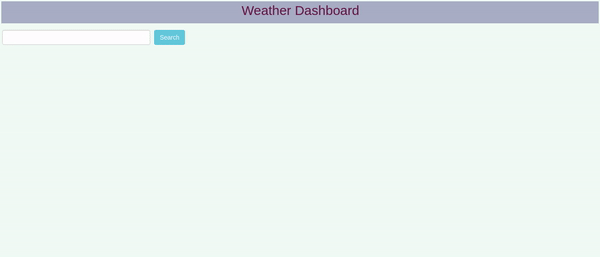
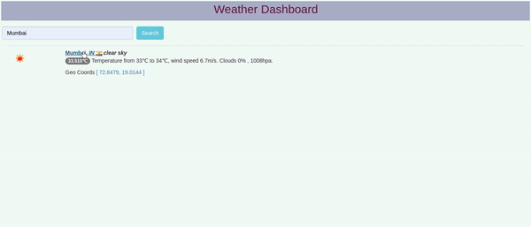
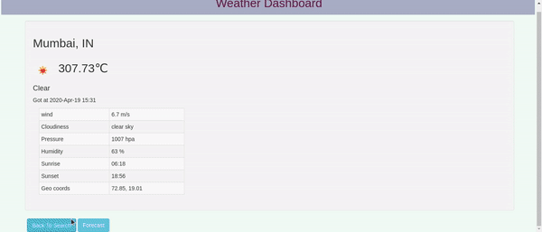

# Weather Dashboard
*"Weather Dashboard by using AngularJs (Angular1.x) version "*

## Getting Started
To get you started you can simply clone the repository and install the dependencies:

## Clone the repository
``` sourceCode console
$ git clone https://github.com/pooja3q/WeatherDashboard.git
cd WeatherDashboard
```

## Overview
View climate conditions, get current weather, daily forecast with weather dashboard.

## Usage
Enter the city name for see the weather report.




### Weather report
This page include all details.



### Forcast Report
Click on the forecast button to see the report.




